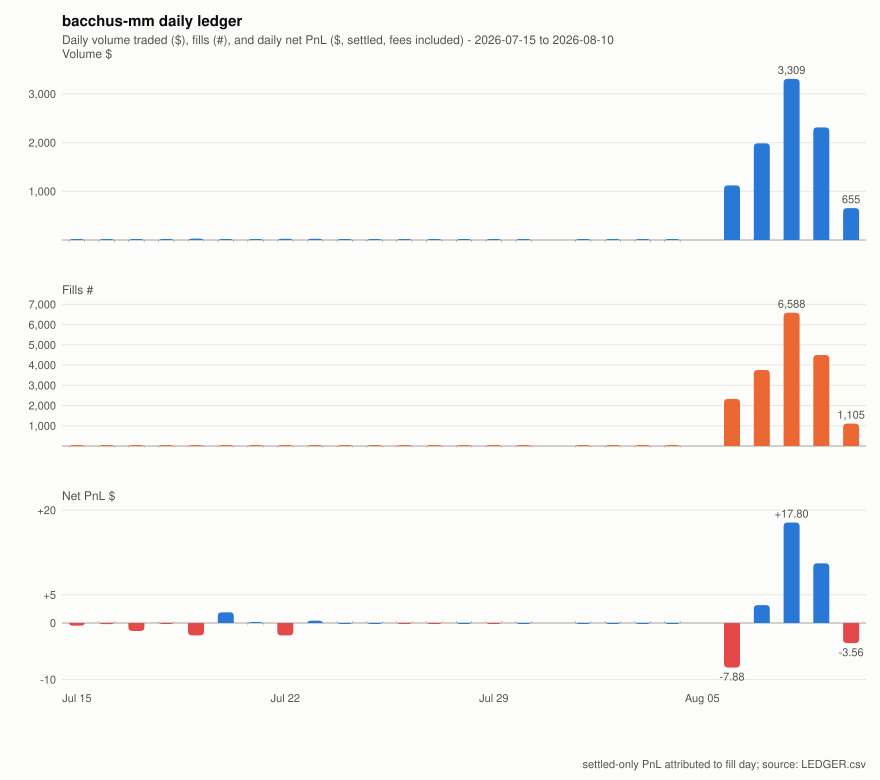

# Daily ledger

Columns: fills = individual executions; markets = distinct
15-minute windows traded (each window is its own market with its
own ticker); contracts = total quantity across fills (fractional:
Kalshi's 15-minute markets let counterparties trade dollar
amounts, so whole-contract orders fill in pieces).

Bot fills are 100% maker (post-only; the daily review asserts
taker == 0 every run). gross = settled PnL before fees, the
spread-captured number, attributed to the fill's UTC day with
late settlements folded in by the daily rebuild; net = gross
minus the day's fees. Full definitions: build_ledger() in
research/daily_review.py. Full history: LEDGER.csv.

| date | fills | markets | contracts | volume $ | cum volume $ | fees $ | cum fees $ | gross pnl $ | net pnl $ | cum net pnl $ |
|---|---|---|---|---|---|---|---|---|---|---|
| 2026-07-15 | 10 | 8 | 19.0 | 9.55 | 9.55 | 0.0000 | 0.0000 | -0.47 | -0.47 | -0.47 |
| 2026-07-16 | 6 | 4 | 11.2 | 3.77 | 13.32 | 0.0000 | 0.0000 | -0.19 | -0.19 | -0.66 |
| 2026-07-17 | 15 | 13 | 27.0 | 17.54 | 30.86 | 0.0000 | 0.0000 | -1.42 | -1.42 | -2.08 |
| 2026-07-18 | 6 | 2 | 12.0 | 5.92 | 36.78 | 0.0000 | 0.0000 | -0.02 | -0.02 | -2.10 |
| 2026-07-19 | 12 | 6 | 57.0 | 27.96 | 64.74 | 0.0000 | 0.0000 | -2.20 | -2.20 | -4.30 |
| 2026-07-20 | 4 | 2 | 20.0 | 9.20 | 73.94 | 0.0000 | 0.0000 | +1.90 | +1.90 | -2.40 |
| 2026-07-21 | 6 | 2 | 30.0 | 14.90 | 88.84 | 0.0000 | 0.0000 | +0.15 | +0.15 | -2.25 |
| 2026-07-22 | 10 | 3 | 47.0 | 23.92 | 112.76 | 0.0000 | 0.0000 | -2.20 | -2.20 | -4.45 |
| 2026-07-23 | 9 | 2 | 41.0 | 23.73 | 136.49 | 0.0000 | 0.0000 | +0.40 | +0.40 | -4.05 |
| 2026-07-24 | 2 | 1 | 10.0 | 5.10 | 141.59 | 0.0000 | 0.0000 | +0.00 | +0.00 | -4.05 |
| 2026-07-25 | 1 | 1 | 1.0 | 0.74 | 142.33 | 0.0000 | 0.0000 | +0.00 | +0.00 | -4.05 |
| 2026-07-26 | 9 | 3 | 19.6 | 9.79 | 152.12 | 0.0379 | 0.0379 | +0.00 | -0.04 | -4.09 |
| 2026-07-27 | 21 | 7 | 39.0 | 20.64 | 172.76 | 0.0522 | 0.0901 | +0.00 | -0.05 | -4.14 |
| 2026-07-28 | 23 | 3 | 39.7 | 19.00 | 191.76 | 0.0000 | 0.0901 | +0.00 | -0.00 | -4.14 |
| 2026-07-29 | 11 | 3 | 18.1 | 10.25 | 202.01 | 0.0317 | 0.1218 | +0.00 | -0.03 | -4.17 |
| 2026-07-30 | 4 | 3 | 6.0 | 3.34 | 205.35 | 0.0000 | 0.1218 | +0.00 | +0.00 | -4.17 |
| 2026-08-01 | 2 | 2 | 4.0 | 1.42 | 206.77 | 0.0000 | 0.1218 | +0.00 | +0.00 | -4.17 |
| 2026-08-02 | 1 | 1 | 2.0 | 1.12 | 207.89 | 0.0000 | 0.1218 | +0.00 | +0.00 | -4.17 |
| 2026-08-03 | 2 | 1 | 4.0 | 2.04 | 209.93 | 0.0000 | 0.1218 | +0.00 | +0.00 | -4.17 |
| 2026-08-04 | 2 | 1 | 4.0 | 2.32 | 212.25 | 0.0000 | 0.1218 | +0.00 | +0.00 | -4.17 |
| 2026-08-06 | 2326 | 73 | 2246.6 | 1,120.71 | 1,332.96 | 0.0155 | 0.1373 | -7.87 | -7.88 | -12.05 |
| 2026-08-07 | 3757 | 335 | 3621.8 | 1,986.54 | 3,319.50 | 0.0012 | 0.1385 | +3.18 | +3.18 | -8.87 |
| 2026-08-08 | 6588 | 239 | 6339.7 | 3,308.75 | 6,628.25 | 0.0027 | 0.1412 | +17.80 | +17.80 | +8.93 |
| 2026-08-09 | 4494 | 191 | 4344.9 | 2,312.11 | 8,940.36 | 0.0006 | 0.1418 | +10.58 | +10.58 | +19.51 |
| 2026-08-10 | 1105 | 179 | 1048.7 | 654.81 | 9,595.17 | 0.0005 | 0.1423 | -3.56 | -3.56 | +15.95 |
